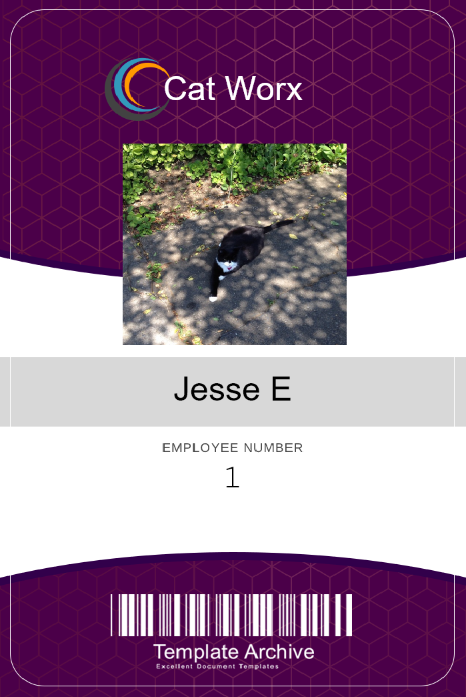

# employee-badge-gen

  

## Description

C# CLI program that creates employee ID cards by either manually entering in employee information or calling a third party API to retrieve random employee data. Badges will be created using SkCanvas.

## Table of Contents

- [Installation](#installation)
- [Usage](#usage)
- [How to contribute](#how-to-contribute)
- [Questions](#questions)
- [License](#license)

## Installation

To install and run this project you will need to clone this repository. once inside of the CatWorx.BadgeMaker project file you will have to install all the needed packages open your dotnet CLI and type "nuget install".

## Usage

Once the packages are installed you then can run this command line interface app. While in the CatWorx.BadgeMaker directory type "dotnet run" to start the program. It will ask if you would like to manually enter in employee data. type "y" to manually enter and "n" to pull from an API to create 10 random badges. While manually entering in data you can stop by hitting enter when you or prompted to enter the employees first name again. A file with the name of "data" will be created and the new files will be created and stored there. Badge images along with a CSV file will be created.

Here is a link to random cat photos when manually entering in badge photoURL's : https://placekitten.com/400/400

## How to Contribute

To contribute please email me, or request to be a contributor on Github. Then push to your branch and request a merge to the main branch and I will review the new code.

## Questions

Here is the link to my Github profile https://github.com/jesseemerson7

please <a href="mailto:jesseemerson7@gmail.com">email me</a> about any questions regarding this project. Feel free to inform me of which repository you are referring to and I can get back to you as soon as possible.

## License

I used the MIT license for this project.